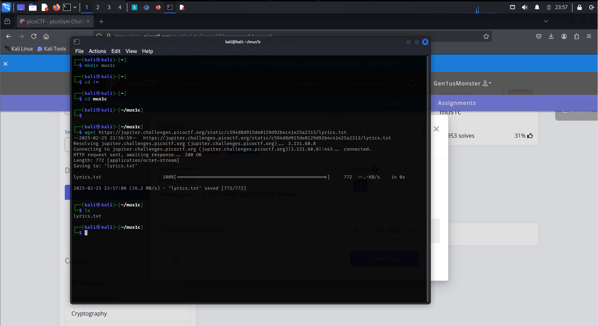
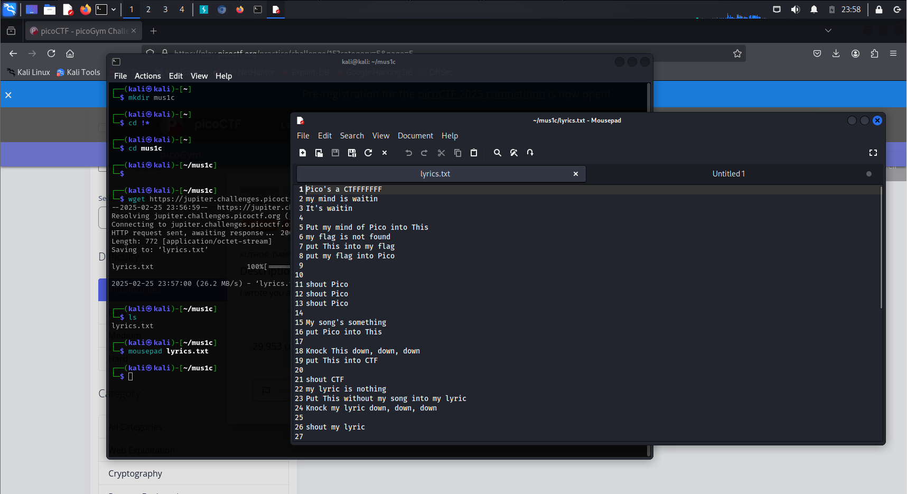
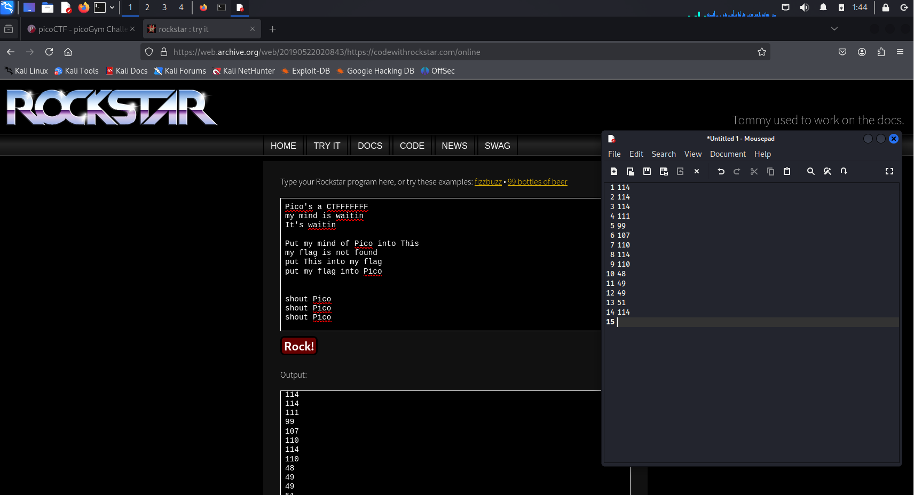
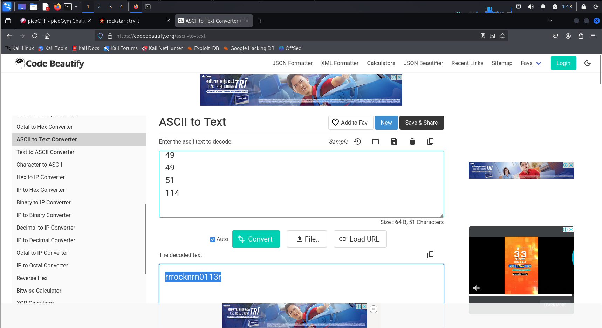

# Medium Challenge

> Read full challenge at: https://play.picoctf.org/practice/challenge/15?category=5&page=5


**Hint**: Do you think you can master rockstar?

> Note: Put it in the picoCTF{} flag format.

## Solution


**Step** 1: Create a folder "mus1c" and download [song](https://jupiter.challenges.picoctf.org/static/c594d8d915de0129d92b4c41e25a2313/lyrics.txt) in this challenge to this folder by using `mkdir` and `wget`

```sh
mkdir mus1c
```

```sh
wget https://jupiter.challenges.picoctf.org/static/c594d8d915de0129d92b4c41e25a2313/lyrics.txt
```




**Step 2** : Open and find the webpage name "Rockstar"

I will use `mousepad` to open the lyrisc.txt 

```sh
mousepad lyrics.txt
```



Following, I will discover the site base on imply of challenge

```
https://web.archive.org/web/20190522020843/https://codewithrockstar.com/online

```

Next, paste the contents of the lyrics.txt file and press "Rock!"

And we see that the web has returned a series of numbers in the Ascii code table.




**Step 3** : Find the `Flag`

I will search for a website with the keyword "convert Ascii code to text" and paste this string of numbers and we will find the flag.




So, the flag is `picoCTF{rrrocknrn0113r}`
