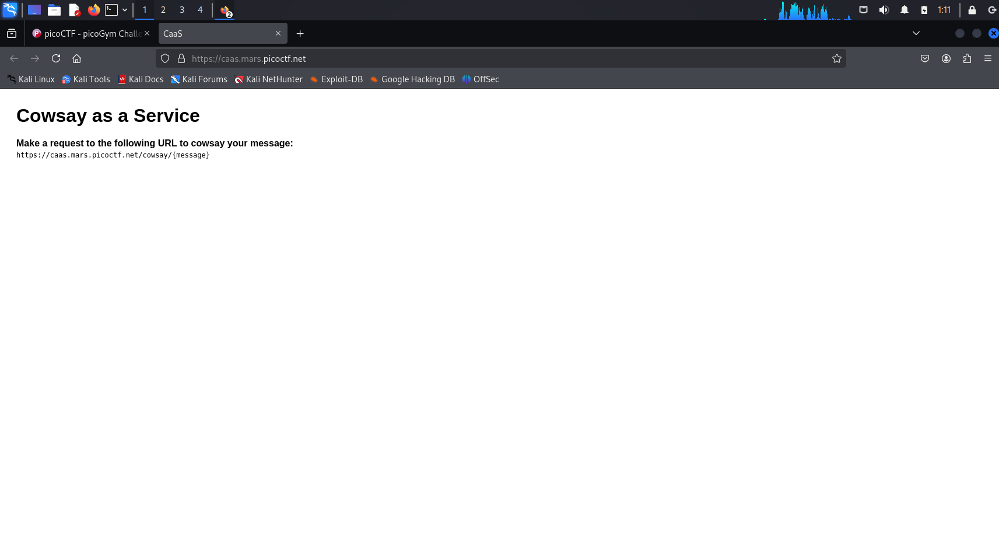
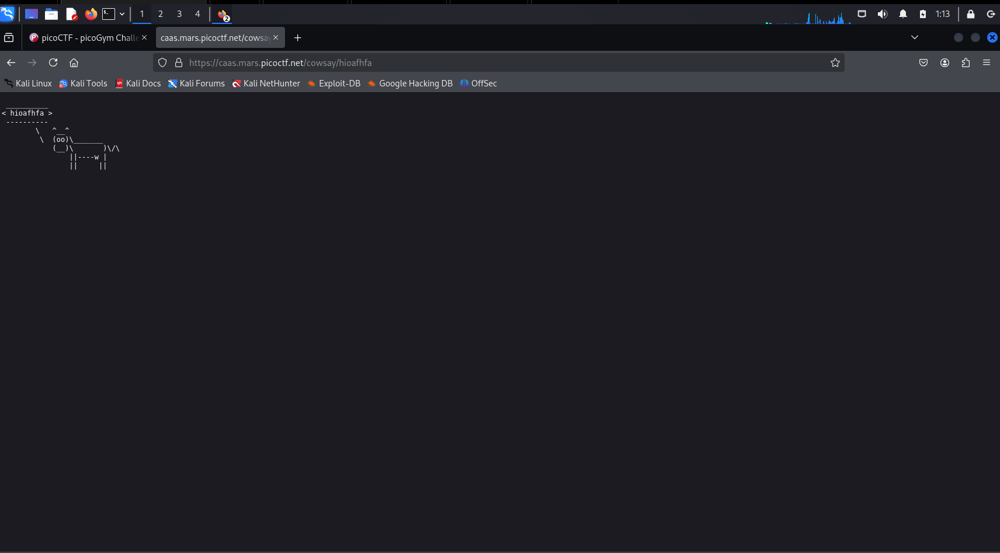

# Medium Challenge

> Read full challenge at: https://play.picoctf.org/practice/challenge/202?category=1&difficulty=2&page=2

**This challenge does not have hint!!!**

## Solution

> So, what is "caas":
>
>  Containers as a service (CaaS) is a cloud-based service that allows software developers and IT departments to upload, organize, run, scale, and manage containers by using container-based virtualization.

- I use FireFox for this challenge

**Step** 1: Copy the [link](https://caas.mars.picoctf.net/) in this challenge and paste into a broswer(Chorme, Firfeox, etc)




**Step 2** : Make a request to the following URL to cowsay your message

Follow the instruction in the website I will copy the URL, the message I will write a random sring like the iamge below 

```
https://caas.mars.picoctf.net/cowsay/jajgagjagjajgal
```

> You can copy and try it on your browser



**Step 3** : Find the `Flag`

As I mention above, caas 


