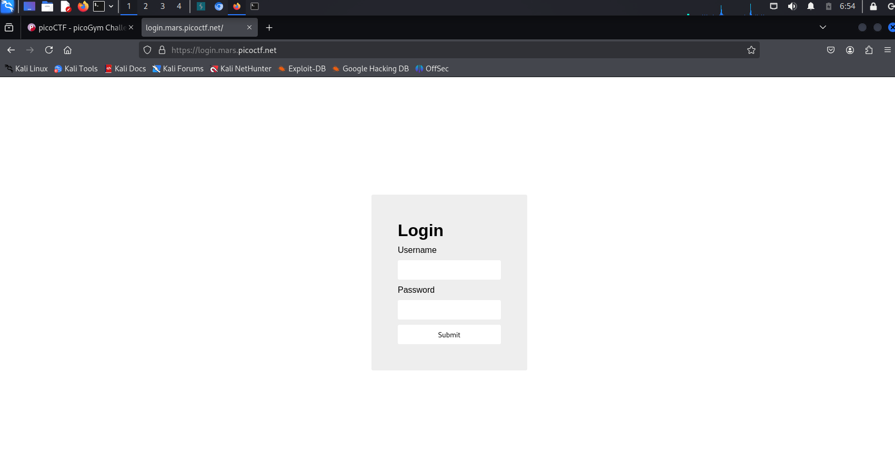
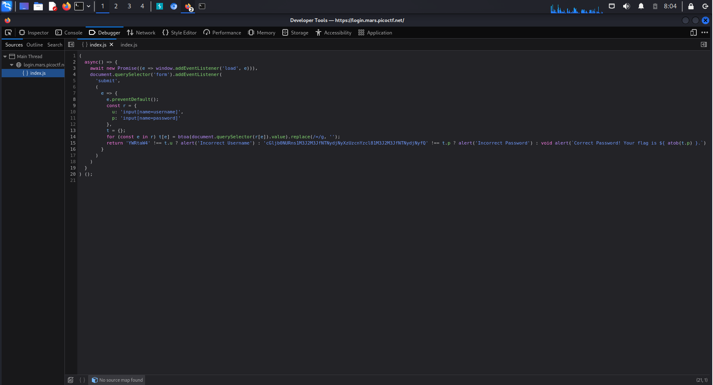

# Mdium Challenge

100 points

> Read full challenge at: https://play.picoctf.org/practice/challenge/200?category=1&difficulty=2&page=2

**This challenge does not have hint!!!**

## Solution

- I use FireFox for this challenge

**Step** 1: Copy the [link](https://login.mars.picoctf.net/) in this challenge and paste into a broswer(Chorme, Firfox, etc)

**Step 2**: 

- Right click -> Inspect

- Move to the Debuger -> Main Thread -> login.mars.picoctf.net -> index.js

- Next, you will read the code and in the line 15 there are two base64 strings include: **"YWRtaW4"** and **"cGljb0NURns1M3J2M3JfNTNydjNyXzUzcnYzcl81M3J2M3JfNTNydjNyfQ"**, it can be the username and password so I will open the terminal and decode it.

**Step 3** : Open the terminal and decode two base64 strings

I will use these commands to decode the string:

**`echo "YWRtaW4" | base64 --decode`**

- Which the string **"YWRtaW4"** after decoding it, I find the username is "admin"
